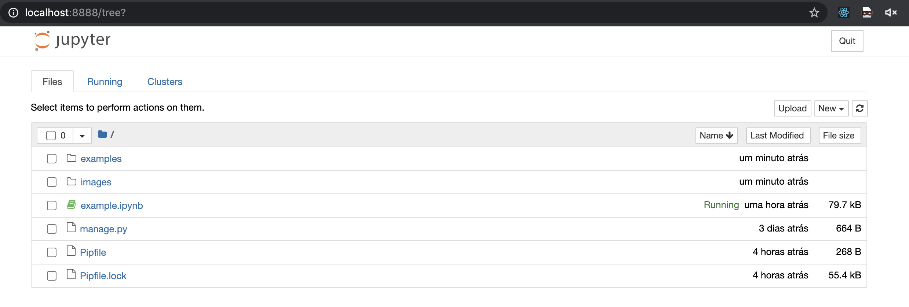

# Django-Stomp Examples

This repository includes some usage examples for [django-stomp](https://github.com/juntossomosmais/django-stomp)!

Just run on your shell:

```sh
docker-compose up app
```

This will start a Jupyter session and you can access it via `http://localhost:8888`.



Now, open the `example.ipynb` notebook and follow the instructions!
